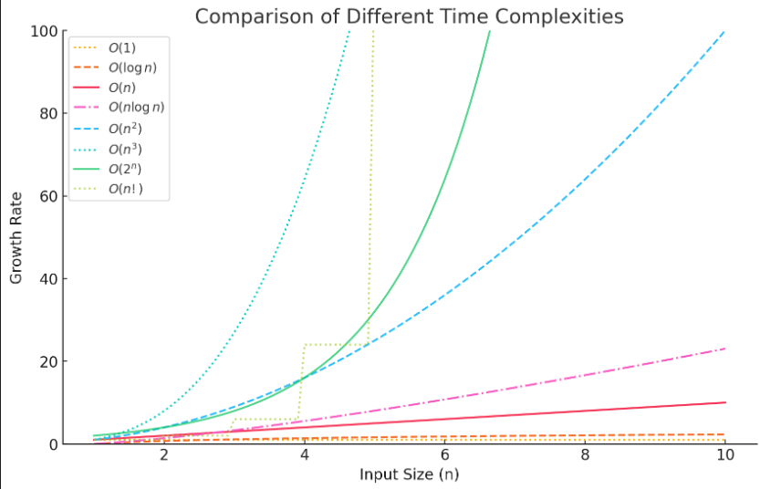

# Contents

- [Asymptotic Notations](#asymptotic-notations)
  - [Big O](#1-big-o-notation-o--upper-bound-worst-case)
  - [Omega](#2-omega-notation-ω--lower-bound-best-case)
  - [Theta](#3-theta-notation-θ--tight-bound-average-case)
- [Memory Management](#memory-management)
  - [Types](#types)
  - [Stack vs Heap](#comparison-stack-vs-heap)
  - [Allocation](#allocation)
- [Data Structure](#data-structure)
- [Matrices](#matrices)
  - [Toeplitz Matrix](#toeplitz-matrix)
  - [Tri Diagonal Matrix](#tri-diagonal-matrix)
  - [Tri Band Matrix](#tri-band-matrix)

# Asymptotic Notations

Asymptotic notation is a mathematical tool used in computer science to describe the efficiency of algorithms in terms of time and space complexity. It helps us analyze how the runtime or space requirements of an algorithm grow as the input size increases.

Asymptotic notation ignores constant factors and lower-order terms, focusing only on the dominant factor that affects performance for large inputs.

## **Types of Asymptotic Notations**

### **1. Big-O Notation (O) – Upper Bound (Worst Case)**

- Represents the worst-case complexity.
- Describes the maximum amount of time an algorithm will take for any input.
- Example: If an algorithm runs in at most $ c \cdot f(n) $ time for large $ n $, we write:
  $
  T(n) = O(f(n))
  $

### **2. Omega Notation (Ω) – Lower Bound (Best Case)**

- Represents the best-case complexity.
- Guarantees that the algorithm takes at least a certain amount of time.
- Example: If an algorithm runs in at least $ c \cdot g(n) $ time for large $ n $, we write:
  $
  T(n) = \Omega(g(n))
  $

### **3. Theta Notation (Θ) – Tight Bound (Average Case)**

- Represents both upper and lower bounds.
- Used when an algorithm always runs in a specific range of time complexity.
- Example: If an algorithm runs in both $ O(f(n)) $ and $ \Omega(f(n)) $, we write:
  $
  T(n) = \Theta(f(n))
  $



- Polynomial - 1, log n, n log n
- Exponential - 2<sup>n</sup>, 3<sup>n</sup>, n<sup>n</sup>

# Memory Management

A program stores in hard drive, executes in CPU.

Think of it like a book:

- **Hard Drive** = A bookshelf where the book (program) is stored when not in use.
- **RAM** = A desk where you place the book while reading it (temporary workspace).
- **CPU** = Your brain, which reads and processes the information from the book.

## Types

**Code Segment**

- Store compiled code.
- It uses stack and heap memory.

**Stack Memory**

- Store global, static variable, function call
- Automatically managed(created, removed)
- Size decided at compile time
- Store data organized way

**Heap Memory**

- Memory allocated during program execution
- Automatically created but manually removed
- when the programs terminates, OS automatically reclaims all allocated heap
- Size decided at run time
- Store data unorganized way
- Treat like resources
- Can't directly use, you have to use pointer to use it

## Comparison: Stack vs Heap

| Feature          | Stack Memory                          | Heap Memory                                            |
| ---------------- | ------------------------------------- | ------------------------------------------------------ |
| **Creation**     | Automatically created                 | Automatically available but requires manual allocation |
| **Deallocation** | Automatic (when function exits)       | Manual (using free() or delete)                        |
| **Speed**        | Faster                                | Slower                                                 |
| **Size**         | Limited                               | Large (depends on system)                              |
| **Lifetime**     | Exists only during function execution | Persists until manually freed                          |
| **Usage**        | Local variables, function calls       | Dynamically allocated memory                           |

- Array created in both heap(`int *p=new int(5)`) and stack(`int arr[]={1,2,3,4,5}`).
- Linkedlist created only in heap.

## Allocation

### Static Memory Allocation

- Memory allocated at **compile time** and doesn't change during program execution, deallocated automatically when program terminates.
- It is stored in the **stack**/data segment.
- Global variable store in data segement and local variable store in stack.

### Dynamic Memory Allocation

- Memory allocated at **runtime** using **pointers**.
- It is store in the **heap** memory.
- Explicit deallocation requires.

**Example:**

```cpp
int *p;  // store at stack as it is local variable
p=new int(5);  // store at heap
```

# Data Structure

Logical data structure uses physical data structure to implement itself.

## Physical Data Structure

- How data is actually stored in memory(RAM, disk).
- Deals with the real-world representation.
- Involves memory management, allocation, data storage.
- Impact performance and access speed.
- Examples: **Array, Linked List**.

## Logical Data Structure

- How data is conceptually organized and how operation performed on it.
- It define relationships, hierarchy.
- Examples: **Stack, Queue**.

# Matrices

- The size of `non-zero` element in upper/lower triangle matrices is `n(n+1)/2`, the size of `zero` element is `n(n-1)/2`.
- The ith item of row major upper/lower triangle matrices is `(i(i-1)/2)+j-1`
- Symmetric matrices can be representede by lower/upper triangluar matrices

## Toeplitz Matrix

A Toeplitz matrix (also known as a diagonally constant matrix) is a special type of matrix where each descending diagonal from left to right is constant. This means that all elements along any given diagonal from the top-left to the bottom-right are identical.

In a one dimensional array initially store the first row, then store the first column.

**Example:**

Let's consider a 4×5 matrix:

```
       1 2 3 4 5
       6 1 2 3 4
       7 6 1 2 3
       8 7 6 1 2
```

## Tri-Diagonal Matrix

A tri-diagonal matrix is a special type of square matrix where nonzero elements appear only on the main diagonal, upper diagonal, and lower diagonal. All other elements are zero.

In a one dimensional array the lower diagonal stores first, then main diagonal and finally upper diagonal.

**Example:**

```
       2 -1  0  0  0
      -1  2 -1  0  0
       0 -1  2 -1  0
       0  0 -1  2 -1
       0  0  0 -1  2
```

## Tri-Band Matrix

A tri-band matrix (also called a band matrix with bandwidth 3) is a generalization of a tri-diagonal matrix. In a tri-band matrix, there are nonzero elements on the main diagonal, two upper diagonals, and two lower diagonals, while the rest are zero.

**Example:**

```
       2 -1  1  0  0
      -1  2 -1  1  0
       2 -1  2 -1  1
       0  3 -1  2 -1
       0  0  4 -1  2
```

## Manipulation

| Matrix Type      | Storage in 1D        | Access Formula (O(1))                                                                                                                             |
| ---------------- | -------------------- | ------------------------------------------------------------------------------------------------------------------------------------------------- |
| **Toeplitz**     | `n + m - 1` elements | `T[j - i + (n-1)]`                                                                                                                                |
| **Tri-Diagonal** | `3n - 2` elements    | **Main:** `T[n-1 + i]` <br> **Lower:** `T[i-1]` <br> **Upper:** `T[2n-2 + j]`                                                                     |
| **Tri-Band**     | `5n - 6` elements    | **Main:** `T[2n-2 + i]` <br> **Lower-1:** `T[n-2 + i]` <br> **Lower-2:** `T[i-2]` <br> **Upper-1:** `T[3n-3 + j]` <br> **Upper-2:** `T[4n-6 + j]` |
